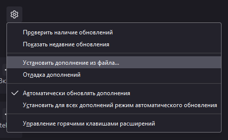

## Смешной аддон для фанатов [pro.guap.ru](https://pro.guap.ru)

Установка на Chrome:
1. Склонировать репозиторий
2. Включить режим разработчика в расширениях  

3. "Загрузить распакованное расширение"
4. Выбрать папку со склонированным расширением

Установка на Mozilla(desktop):
1. Склонировать репозиторий
2. Все файлы(кроме .git) упаковать в zip архив
3. В about:addons найти "шестеренку", выбрать "установить дополнение из файла"  

Установка на Mozilla(android): в разработке